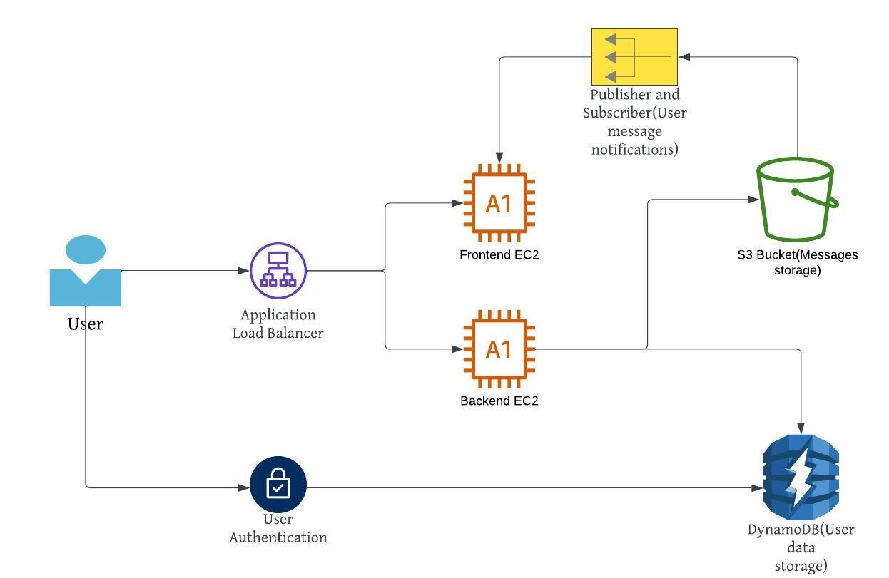
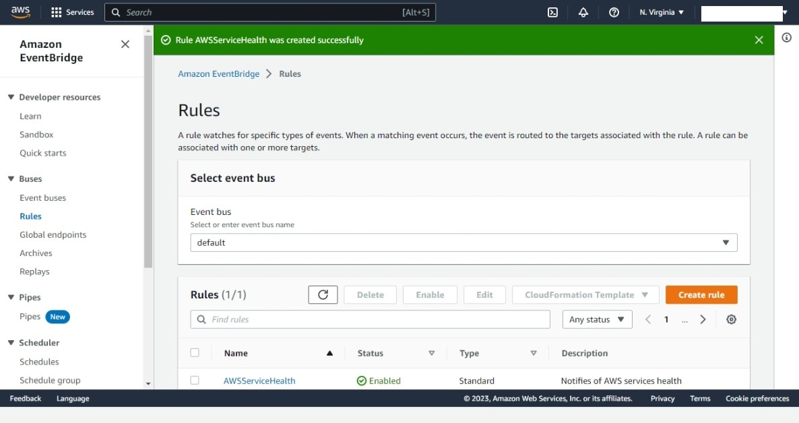
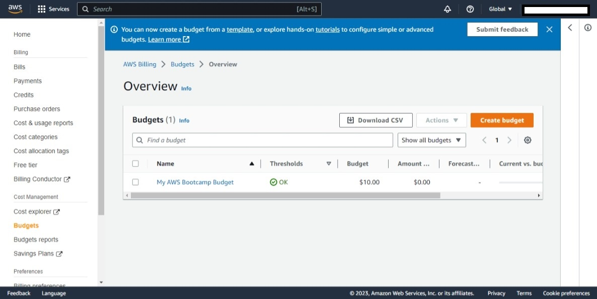

# Week 0 — Billing and Architecture
# Architectural Diagram
This is an architectural diagram of the proposed application

# Create User and assign MFA
Created and admin user with multi factor authentication

# Created an Event Bridge with SNS notification for Amazon Health Services

# Created Budget
