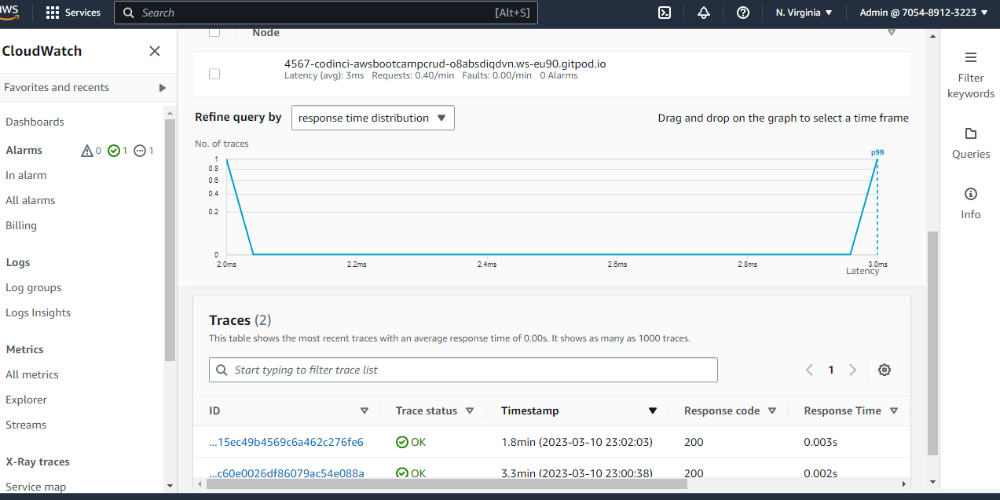

# Week 2 — Distributed Tracing
# Implemented Honeycomb Backend
This is traces from the backend

```
{
  "duration_ms": 2.723318,
  "http.flavor": "1.1",
  "http.host": "4567-codinci-awsbootcampcrud-o8absdiqdvn.ws-eu90.gitpod.io",
  "http.method": "GET",
  "http.route": "/api/activities/home",
  "http.scheme": "http",
  "http.server_name": "0.0.0.0",
  "http.status_code": 200,
  "http.target": "/api/activities/home",
  "http.user_agent": "Mozilla/5.0 (Windows NT 10.0; Win64; x64) AppleWebKit/537.36 (KHTML, like Gecko) Chrome/110.0.0.0 Safari/537.36 Edg/110.0.1587.63",
  "library.name": "opentelemetry.instrumentation.flask",
  "library.version": "0.37b0",
  "meta.signal_type": "trace",
  "name": "/api/activities/home",
  "net.host.port": 4567,
  "net.peer.ip": "192.168.251.10",
  "net.peer.port": 56162,
  "service.name": "cruddur-backend",
  "span.kind": "server",
  "span.num_events": 0,
  "span.num_links": 0,
  "status_code": 0,
  "telemetry.instrumentation_library": true,
  "telemetry.sdk.language": "python",
  "telemetry.sdk.name": "opentelemetry",
  "telemetry.sdk.version": "1.16.0",
  "trace.span_id": "3fc1a9d1b5e08268",
  "trace.trace_id": "995f9fdd86d18feae4c374f3587dc754",
  "type": "server"
}
```
# Implemented Honeycomb Frontend
This is the tracing.js file
```
import { OTLPTraceExporter } from '@opentelemetry/exporter-trace-otlp-http';
import { WebTracerProvider, BatchSpanProcessor } from '@opentelemetry/sdk-trace-web';
import { ZoneContextManager } from '@opentelemetry/context-zone';
import { Resource }  from '@opentelemetry/resources';
import { SemanticResourceAttributes } from '@opentelemetry/semantic-conventions';

const exporter = new OTLPTraceExporter({
  url: "https://api.honeycomb.io/v1/traces",
  headers: {
    "x-honeycomb-team": process.env.HONEYCOMB_API_KEY,
  },
});

const provider = new WebTracerProvider({
  resource: new Resource({
    [SemanticResourceAttributes.SERVICE_NAME]: 'browser',
  }),
});

provider.addSpanProcessor(new BatchSpanProcessor(exporter));
provider.register({
  contextManager: new ZoneContextManager()
});
```
HomeFeed.js
```
 const loadData = async () => {   
    const backend_url = `${process.env.REACT_APP_BACKEND_URL}/api/activities/home` ;
    return tracer.startActiveSpan(`Home Feed Request: Get ${backend_url}`, async (span) => {

      const traceparent = `00-${span.spanContext().traceId}-${span.spanContext().spanId}-01`;
      try {      
        const res = await fetch(backend_url, {
          method: "GET",
          traceparent: traceparent,
        });

        // Set span attributes for http request
        span.setAttributes({
          'http.method': 'GET',
          'http.url': backend_url,
          'response.status_code': res.status,
        });

        let resJson = await res.json();
        if (res.status === 200) {
          // Set Span status for request status code
          span.setStatus({ code: SpanStatusCode.OK });
          setActivities(resJson)
        } else {
          console.log(res)
        }
      } catch (err) {
        // Set Span for any error message
        span.setStatus({
          code: SpanStatusCode.ERROR,
          message: err.message,
        });
        console.log(err);
      } finally {
        span.end();
      }
    })
  };
```

# Implemented X-ray Traces


# Implemented rollbar
<ul>
<li> Rollbar Imports</li>

```
import os
import rollbar
import rollbar.contrib.flask
from flask import got_request_exception
from flask import Request
```
<li>Initialising rollbar</li>

```
#Implementing rollbar
rollbar_access_token = os.getenv('ROLLBAR_ACCESS_TOKEN')
@app.before_first_request
def init_rollbar():
    """init rollbar module"""
    rollbar.init(
        # access token
        rollbar_access_token,
        # environment name
        'production',
        # server root directory, makes tracebacks prettier
        root=os.path.dirname(os.path.realpath(__file__)),
        # flask already sets up logging
        allow_logging_basic_config=False)

    # send exceptions from `app` to rollbar, using flask's signal system.
    got_request_exception.connect(rollbar.contrib.flask.report_exception, app)
```
<li>Endpoint to test rollbar</li>

```
#Endpoint to test rollbar
@app.route('/rollbar/test')
def rollbar_test():
   rollbar.report_message('Hello World!', 'warning')
   return 'Hello World'
```


<li>Rolbar with people tracking</li>

```
@app.route('/people/track')
def hello():
    print("in hello")
    x = None
    x[5]
    return "Hello World!"

```


</ul>
